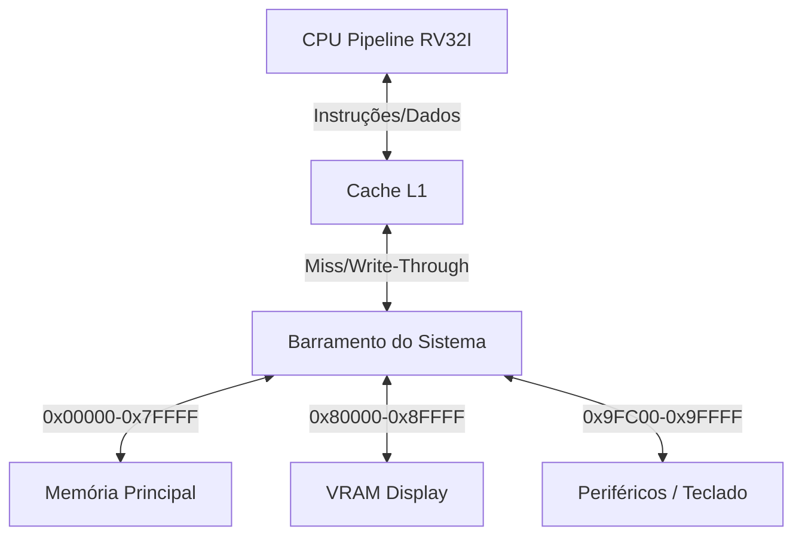

# Documentação Técnica: Simulador RISC-V RV32I

## 1. Visão Geral do Sistema

O projeto consiste em um simulador de software para a arquitetura de conjunto de instruções (ISA) **RISC-V RV32I** (Base Integer Instruction Set, 32-bit). O sistema foi projetado seguindo a organização de computadores clássica, segregando componentes de processamento, memória e interconexão.

O diferencial desta implementação é a substituição da microarquitetura monociclo padrão por uma arquitetura em **Pipeline de 5 estágios**, integrada a um sistema de **Memória Cache L1** e controlador de **Interrupções**, visando alta performance e fidelidade arquitetural, conforme os requisitos de pontuação extra do projeto.

---

## 2. Arquitetura de Hardware Simulado

O sistema é composto pelos seguintes módulos interconectados:

1.  **CPU (Central Processing Unit):** Núcleo RV32I com Pipeline.
2.  **Cache L1:** Memória de acesso rápido entre CPU e Barramento.
3.  **Barramento (System Bus):** Canal de comunicação centralizado.
4.  **Memória Principal (RAM):** Armazenamento volátil endereçável.
5.  **VRAM (Video RAM):** Memória mapeada para saída de vídeo.
6.  **Controlador de E/S (Teclado):** Dispositivo de entrada gerador de interrupções.

### Diagrama de Blocos Lógico

## 3. Detalhamento dos Componentes

### 3.1. CPU (Pipeline)
A CPU não executa todas as operações em um único ciclo de clock. Ela implementa um pipeline clássico de 5 estágios, permitindo o processamento paralelo de múltiplas instruções.

* Estágios:

1. IF (Instruction Fetch): Busca a instrução no endereço PC via Cache.

2. ID (Instruction Decode): Decodifica o opcode, lê os registradores (rs1, rs2) e estende imediatos.

3. EX (Execute): Realiza operações na ULA (ALU) e calcula endereços efetivos.

4. MEM (Memory Access): Acessa a memória de dados para instruções LOAD/STORE.

5. WB (Write Back): Escreve o resultado no registrador de destino (rd).

* Controle de Hazards (Conflitos):
  * Forwarding (Adiantamento): Implementado para resolver dependências de dados RAW (Read-After-Write) sem inserir "bolhas" no pipeline. O dado é repassado do estágio EX ou MEM diretamente para o estágio EX da próxima instrução.
  * Stall (Bolha): Implementado para casos onde o forwarding não é possível (ex: Load-Use Hazard), pausando o estágio IF e ID por um ciclo.
* Interrupções: A CPU verifica a flag interrupcao_pendente antes de iniciar um novo ciclo. Se ativa (via teclado), o fluxo é desviado para o vetor de interrupção (endereço fixo 0x1000) e o PC atual é salvo para retorno posterior.

* ### Memória Cache
Implementada para mitigar a latência de acesso à memória principal, interpondo-se entre a CPU e o Barramento.

* Organização: 256 Linhas.

* Mapeamento: Direto (Direct Mapped).

* Política de Escrita: Write-Through (a escrita ocorre na cache e na memória principal simultaneamente para garantir consistência).

* Campos da Linha: Validade, Tag, Dados (Bloco de 4 palavras/16 bytes).

### Barramento e Mapa de Memória
O barramento atua como o decodificador de endereços do sistema, roteando as requisições de leitura/escrita para o dispositivo correto com base no mapa de memória especificado no projeto:

| Faixa de Endereço (Hex) | Dispositivo | Descrição |
| :--- | :---: | :--- |
| **0x00000 - 0x7FFFF** | RAM Principal | Dados e Instruções. |
| **0x80000 - 0x8FFFF** | VRAM | Memória de Vídeo (Mapeada para Console). |
| **0x90000 - 0x9FBFF** | Reservado | Espaço para expansão futura. |
| **0x9FC00 - 0x9FFFF** | Periféricos | E/S Mapeada (Memory Mapped I/O). |

### 3.4. Periféricos de E/S

* Vídeo (VRAM): Simula um display matricial. O simulador varre periodicamente a faixa de endereços da VRAM e renderiza os caracteres ASCII correspondentes no terminal.
* Teclado: Utiliza bibliotecas de sistema (conio.h no Windows ou termios.h no Linux) para capturar teclas de forma assíncrona (polling). Gera uma interrupção externa para a CPU quando uma tecla é pressionada.

* ## 4. Conjunto de Instruções Suportado (RV32I Base)
O simulador suporta as instruções fundamentais da ISA RV32I:

* Aritmética/Lógica (R-Type/I-Type): ADD, SUB, AND, OR, XOR, SLT, SLL, SRL, SRA e suas variantes imediatas (ADDI, etc.).
* Acesso à Memória (Load/Store): LB, LH, LW, LBU, LHU, SB, SH, SW (Little-Endian).
* Desvios Condicionais (B-Type): BEQ, BNE, BLT, BGE, BLTU, BGEU.
* Saltos Incondicionais (J-Type): JAL, JALR.
* Constantes: LUI, AUIPC.
* Ambiente: ECALL (utilizada para finalizar a simulação ou chamadas de sistema).

## 5. Estrutura do Código Fonte
O projeto utiliza Programação Orientada a Objetos (POO) em C++ para modularizar os componentes de hardware:

* main.cpp: Ponto de entrada. Carrega o binário na memória e inicia o loop de clock.
* simulador.cpp/h: Classe "Placa-Mãe". Instancia e conecta todos os componentes (CPU, Bus, Mem).
* cpu.cpp/h: Implementação do Pipeline e lógica de controle.
* cache.cpp/h: Lógica de Hit/Miss e armazenamento temporário.
* memoria.cpp/h: Array de bytes representando a RAM e lógica de Little-Endian.
* barramento.cpp/h: Roteador de endereços e tratamento de exceções de acesso (out_of_range).
* vram.h: Lógica de renderização de vídeo.
* teclado.cpp/h: Abstração de hardware de entrada.

## 6. Tratamento de Exceções e Erros
O simulador utiliza o mecanismo de exceções do C++ (std::runtime_error) para tratar paradas críticas de simulação, como instruções ECALL (fim de programa) ou acesso a memória inválida (fora do mapa permitido), garantindo que o simulador encerre de forma segura e reporte o erro ao usuário.
